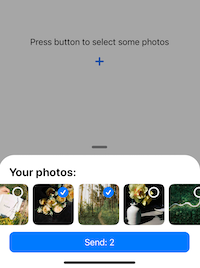
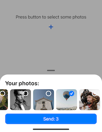

## Image Picker 😻 SwiftUI  

1. About
2. Examples
   1. Modal Views
   2. Picker 
3. Documentation

## Some screenshots

 


### About 

This project will help you figure out how to make a custom picture selection from the gallery. You can select one or more pictures and use the camera to take new pictures. This example will save you a lot of time in debugging and in fixing memory errors. 


### Examples

1. Connect **ModalAnchorView** to init view - in this case it will cover all other content

```swift
ZStack {
  Home()
  ModalAnchorView()
}
```

2. **Home.swift** onAppear{} load modal view befour you call it - this way it will show in moment after you press button **+**

```swift
.onAppear {
  DispatchQueue.main.asyncAfter(deadline: .now() + 0.1) {
    self.modal.newModal(position: .closed) {
      ModalImages()
        .clipped()
    }
  }
}
```

3. Call view images on **Button Click**

```swift
DispatchQueue.main.asyncAfter(deadline: .now()) {
  [self] in
  self.modal.openModal()
}
```

4. **Images.swift** add camera view. There 2 different views - one is preview 80x80 and second is full screen to caprure images

```swift
 ZStack {
   CustomCameraView()
     .frame(width: 80, height: 80)
     .cornerRadius(10)
     .padding(.trailing, 4)

   Image(systemName: "camera")
     .font(.system(size: 20, weight: .bold, design: .rounded))
     .foregroundColor(Color.init(hex: "F2F3F4"))
 }.onTapGesture {
   self.open_camera.toggle()
 }
```

5. Set global variable **PHImageManager.default()**

```swift
let manager = PHImageManager.default()
```

6. **ImageLoaderLibrary** - We load each image from library separately. 

```swift
.onAppear {

  if (true) {
    DispatchQueue.global(qos: .utility).async {

      let options = PHImageRequestOptions()
      options.isSynchronous = true
      options.deliveryMode = PHImageRequestOptionsDeliveryMode.opportunistic
      // iCloud Images Hosted
      options.isNetworkAccessAllowed = true

      //.init(width: 380, height: 380) - fix memory issue
      manager.requestImage(
        for: asset, targetSize: .init(width: 380, height: 380), contentMode: .aspectFill, options: options) {
        (image, _) in
        let compressed = UIImage(data: image!.jpeg(.lowest) !)

        print("Result Size Is \(image!.size)")

        DispatchQueue.main.async {
          self.image = compressed!
            self.process = true
        }
      }

    }
  }

}
```

7. Fix images load - images will not be displayed if they are not showing on the screen, so memory will not get over 

```swift
 GeometryReader {
   geo in
     if (geo.frame( in: .global).minX > -400 && geo.frame( in: .global).minX < UIScreen.main.bounds.size.width + 400) {
					// Your code with images
     }

 }
```

